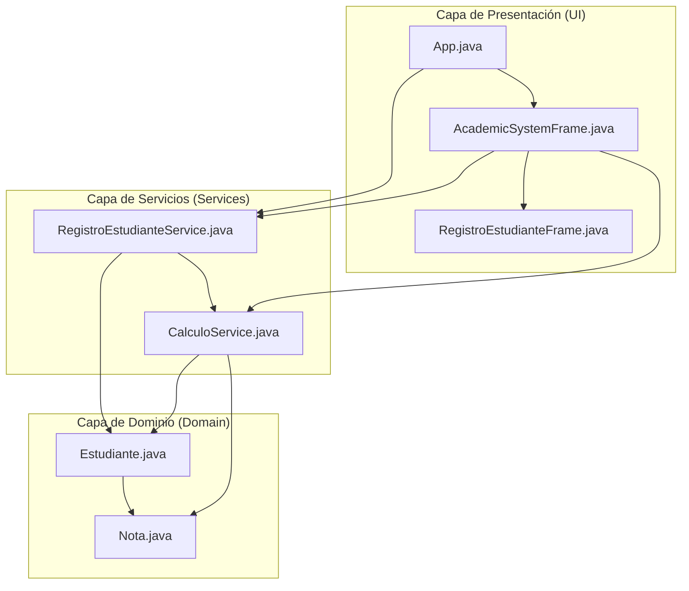
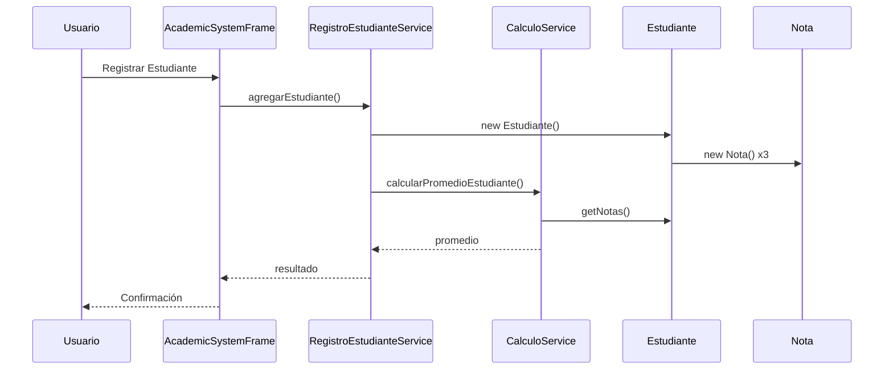

# Sistema Académico - Gestión de Estudiantes

## Descripción
Sistema académico desarrollado en Java con interfaz gráfica (Swing) para la gestión de estudiantes y sus calificaciones. El proyecto implementa una arquitectura por capas con inyección de dependencias.

## Características
- ✅ **Interfaz Gráfica Moderna**: Interfaz de usuario intuitiva con pestañas
- ✅ **Registro de Estudiantes**: Formulario completo para registrar nuevos estudiantes
- ✅ **Gestión de Notas**: Sistema de calificaciones con validación (0.0 - 5.0)
- ✅ **Búsqueda de Estudiantes**: Búsqueda por ID con información detallada
- ✅ **Estadísticas Académicas**: Cálculo automático de promedios y estadísticas
- ✅ **Arquitectura por Capas**: Separación clara entre UI, Services y Domain
- ✅ **Inyección de Dependencias**: Patrón de diseño implementado correctamente

## Funcionalidades

### 1. Registro de Estudiantes
- Formulario con validación de datos
- Campos: ID, Nombre, Edad, 3 Notas (0.0-5.0)
- Cálculo automático de promedio y estado académico
- Validación de duplicados por ID

### 2. Lista de Estudiantes
- Tabla con todos los estudiantes registrados
- Columnas: ID, Nombre, Edad, Nota 1, Nota 2, Nota 3, Promedio, Estado
- Visualización clara y organizada

### 3. Búsqueda de Estudiantes
- Búsqueda por ID del estudiante
- Información detallada del estudiante encontrado
- Cálculo de promedio y estado académico

### 4. Estadísticas Académicas
- Total de estudiantes registrados
- Número de estudiantes aprobados y reprobados
- Promedio general de todos los estudiantes
- Porcentaje de aprobación

## Arquitectura del Proyecto

```
src/main/java/com/codeup/academico/
├── App.java                          # Clase principal
├── Domain/                           # Capa de Dominio
│   ├── Estudiante.java              # Entidad Estudiante
│   └── Nota.java                    # Entidad Nota
├── Services/                         # Capa de Servicios
│   ├── CalculoService.java          # Servicio de cálculos
│   └── RegistroEstudianteService.java # Servicio de registro
└── UI/                              # Capa de Interfaz de Usuario
    ├── AcademicSystemFrame.java     # Interfaz gráfica principal
    └── RegistroEstudianteFrame.java # Interfaz de consola (legacy)
```

### Diagrama de Arquitectura



### Flujo de Datos



## Tecnologías Utilizadas
- **Java 8+**
- **Swing** (Interfaz Gráfica)
- **Maven** (Gestión de dependencias)
- **Arquitectura por Capas**
- **Inyección de Dependencias**

## Cómo Ejecutar

### Prerrequisitos
- Java 8 o superior
- Maven 3.6 o superior

### Compilación
```bash
mvn clean compile
```

### Ejecución
```bash
mvn exec:java -Dexec.mainClass="com.codeup.academico.App"
```

### Ejecución con JAR
```bash
mvn clean package
java -jar target/academico-1.0-SNAPSHOT.jar
```

## Uso de la Aplicación

1. **Iniciar la Aplicación**: Ejecutar el comando Maven mostrado arriba
2. **Registrar Estudiante**: 
   - Ir a la pestaña "Registrar"
   - Completar todos los campos requeridos
   - Hacer clic en "Registrar Estudiante"
3. **Ver Lista**: Ir a la pestaña "Lista de Estudiantes" para ver todos los registros
4. **Buscar Estudiante**: Usar la pestaña "Buscar Estudiante" para encontrar un estudiante específico
5. **Ver Estadísticas**: La pestaña "Estadísticas" muestra información general del sistema

## Validaciones Implementadas
- **ID**: No puede estar vacío y debe ser único
- **Nombre**: No puede estar vacío
- **Edad**: Debe ser un número entero positivo
- **Notas**: Deben estar entre 0.0 y 5.0
- **Cantidad de Notas**: Exactamente 3 notas por estudiante

## Criterios de Aprobación
- **Aprobado**: Promedio >= 3.0
- **Reprobado**: Promedio < 3.0

## Autor
**Coder** - Sistema Académico con Interfaz Gráfica
